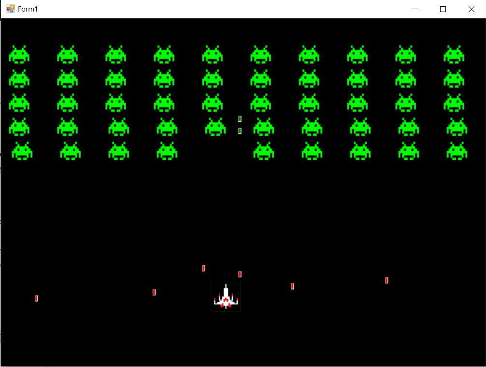

# Space Invaders

by Bardia Parmoun

## DESCRIPTION
- This repository simulates the game space invaders

## USAGE
- First locate and open the "space invaders.exe" file
- You can use the right and left arrow keys <kbd>&#8592; left</kbd> <kbd>right &#8594;</kbd> to move the rocket right and left.
- You can use the down key <kbd>space</kbd> key to shoot at the aliens.
  
## Examples

- Here is an example of using the program:

## CREDITS
Author: Bardia Parmoun

Copyright © 2021 Bardia Parmoun. All rights reserved
